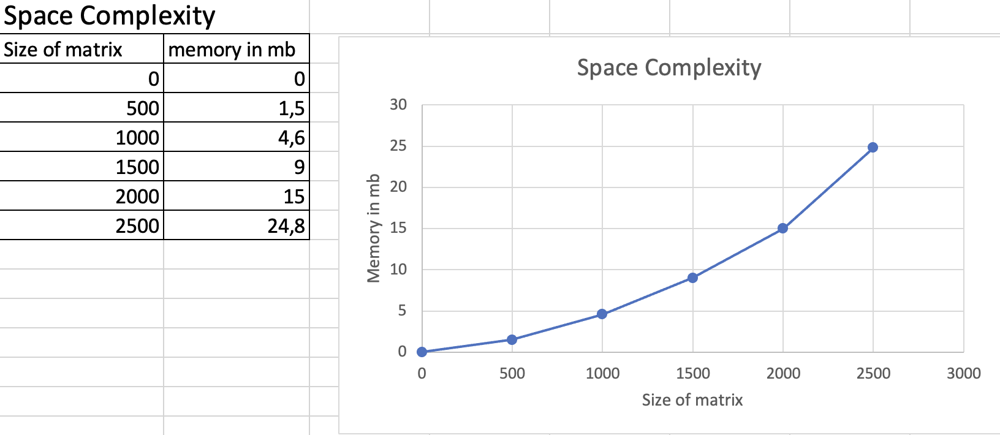

# Matrix Vector multiplication benchmark
Test for space and time complexity. Using the third learning path from scicomp github repo i took parts of utils and made it into mylib/ mylib.c and mylib.h. Also the make file and part of main.c for this assignment.
## Testing
Using the ```matVecMult``` function which takes ```M```, ```V```, ```vo``` and ```N``` we can test whether the multiplication process works well or is faulty. If the actual output is same with expected output then the code runs correctly with the 3 test cases below.   
Please type the following into the terminal:
```
make test
```
Output to show that it is correct:
```
Test #1:
Actual V[0] = 32; Expected V[0] = 32
Actual V[1] = 31; Expected V[1] = 31
Actual V[2] = 39; Expected V[2] = 39

Test #2:
Actual V[0] = 109; Expected V[0] = 109
Actual V[1] = 49; Expected V[1] = 49
Actual V[2] = 69; Expected V[2] = 69

Test #3:
Actual V[0] = 56; Expected V[0] = 56
Actual V[1] = 89; Expected V[1] = 89
Actual V[2] = 101; Expected V[2] = 101
```
## Time Complexity
Please type the following into the terminal:
```
make time
```
Output for N=0:
```
Time elapsed with N = 0 : 0.000011 s
```
plotted graph for time complexity:  


## Space Complexity
Please type the following into the terminal:
```
make space
```
Output for N=1000 by checking activity monitor:


For all example of N=0 all the way up to N=2500:


**Conclusion**
For both space and time complexity, the more number of N which means matrix size increasing, the more number of time and space is required.


